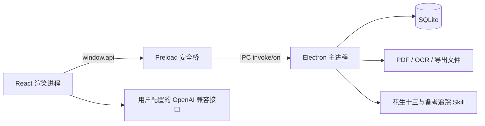

# 公考小助手 3.0.1 核心版技术文档

## 1. 目标

公考小助手是本地优先的 Windows 公考学习桌面端。3.0.1 核心版不再追求页面数量，而是围绕五条高频链路组织功能：

1. 真题导入 → 校对 → 题库 → 模考
2. 做题 → 错题 → 今日复习 → 错因复盘
3. 申论 OCR → 批改 → 用时记录 → 纸笔答题纸
4. AI 名师/RAG → 题型化讲解 → 个人知识库
5. 训练记录 → 备考追踪 → 能力树 → 薄弱项行动

## 2. 页面结构

### 2.1 主导航

| 路由 | 页面 | 职责 |
| --- | --- | --- |
| `/` | `DashboardNew.tsx` | 今日待办、连续学习和核心流程入口 |
| `/review` | `ReviewHub.tsx` | 到期卡片与错题的统一复习 |
| `/mock-exam` | `MockExam.tsx` | 套题、计时、答题报告和 AI 分析 |
| `/question-bank` | `QuestionBank.tsx` | 结构化题目管理与真题流程入口 |
| `/essay-review` | `EssayReview.tsx` | 申论 OCR、批改、用时与改写建议 |
| `/rag-chat` | `RagChat.tsx` | 花生十三教学模式与通用 RAG |
| `/study-tracker` | `StudyTracker.tsx` | 训练记录、总结与复盘 |
| `/settings` | `Settings.tsx` | AI、备份、更新和主题配置 |

### 2.2 二级页面

| 路由 | 页面 | 上级流程 |
| --- | --- | --- |
| `/wrong-book` | `WrongBook.tsx` | 今日复习 |
| `/real-papers` | `RealPapers.tsx` | 真题题库 |
| `/paper-import` | `PaperImportWorkbench.tsx` | 真题题库 |
| `/essay-practice` | `EssayPractice.tsx` | 申论训练 |
| `/skill-tree` | `SkillTree.tsx` | 备考追踪 |

历史路由 `/flashcards` 重定向到 `/review`，`/study-plan` 重定向到 `/study-tracker`。其他未知路由回首页。

## 3. 已删除的桌面模块

已删除番茄钟、成就页、聊天室、鼓励语录、思维导图、知识图谱、独立学习计划页、独立记忆卡片页、打卡倒计时、残酷报告、组件展示页，以及所有重复的新旧版页面壳。

对应的腾讯云聊天前端封装、聊天 store、图表/弹窗孤立组件和专用依赖也已删除。历史数据库表与旧 IPC 暂时保留，仅承担旧数据兼容职责。

## 4. 技术架构



- Electron 主进程：`src/main/`
- React 渲染进程：`src/renderer/`
- IPC 契约：`src/shared/ipc.ts`
- 数据库 Schema：`src/main/db/schema.ts`
- 主 IPC 注册：`src/main/ipc/index.ts`
- Preload：`src/main/preload.ts`

安全边界：主窗口开启 `contextIsolation`，关闭 `nodeIntegration`；渲染进程不得直接访问 Node 文件系统。

## 5. 真题导入工作台

`PaperImportWorkbench.tsx` 负责导入、解析、分段、校对和确认。主进程相关能力包括 PDF 文本提取、OCR、试卷草稿解析和结构化导入。

关键约束：

- 文本型 PDF 优先使用文本解析。
- 扫描件进入 OCR 路径。
- 入库前允许人工校对题号、题型、题干、选项和答案。
- 确认后的题目可被题库与模考复用。
- 不导入或分发第三方版权题库内容。

## 6. 申论训练闭环

- `EssayReview.tsx`：题目、作答与标准答案 OCR；AI 批改；建议用时和实际用时；修改清单。
- `EssayPractice.tsx`：按题数、字数和用时生成标准答题格；支持 PDF/PNG。
- `src/main/ipc/essay-paper.ts`：答题纸导出逻辑。
- 花生十三申论模式只给审题框架与修改建议，不代写完整范文。

## 7. AI 名师与 RAG

`RagChat.tsx` 同时承载个人知识库检索和题型化教学。教学模式由 `src/main/ipc/huasheng13.ts` 选择匹配资料并构造系统提示词。

核心模式：花生十三自动识别、行测速解、基础讲解、申论审题、错因复盘、备考规划和通用 RAG。

用户必须在设置页配置自己的 OpenAI 兼容接口。API Key 不应写入仓库。

## 8. 备考追踪与能力树

### 8.1 kaogong-study-tracker

上游项目以完整快照放在：

```text
src/main/skills/kaogong-study-tracker/
```

固定 Commit：

```text
cf9fafd3c607650f48470c0faced14a2d165cf39
```

该目录禁止修改。桌面端只通过适配层暴露状态、训练记录、总结和复盘 4 个核心动作。构建脚本会把快照复制到 `dist/main/skills/kaogong-study-tracker/`。

### 8.2 human-skill-tree

能力树页面只吸收能力节点、层级和进度反馈的设计思路，代码为本项目独立实现。

## 9. 数据兼容

主数据库默认位于：

```text
%APPDATA%/gongkao-assistant/gongkao.db
```

备考追踪数据默认位于：

```text
%USERPROFILE%/.kaogong-study-tracker/data/
```

删除桌面页面不等于删除用户数据。旧表和旧字段暂时保留，后续如需物理迁移必须先提供备份、迁移脚本和回滚方案。

## 10. 测试与防回退

`tests/run-ipc-contract-tests.js` 覆盖：

- IPC 兼容序列化
- 复习调度
- PDF 真题解析与草稿校验
- 申论答题纸与花生十三提示词
- 上游 Skill 源码/构建产物一致性
- 备考追踪只暴露 4 个核心动作
- 侧栏只保留 8 个主入口
- 非核心路由、页面和依赖不得回流

标准验证：

```bash
npm run lint
npm run test
npm run build:all
node scripts/verify-kaogong-study-tracker.js
node scripts/verify-kaogong-study-tracker.js dist/main/skills/kaogong-study-tracker
```

打包后执行：

```bash
node scripts/verify-packaged-study-tracker.js
```

## 11. 发布检查

1. TypeScript 检查通过。
2. IPC 与核心化防回退测试通过。
3. Vite 构建不再生成已删除页面或 `chat-sdk` chunk。
4. 上游备考追踪快照保持 28 个文件且 Commit 不变。
5. 安装版和便携版均可启动。
6. E 盘目标仓库中的用户未跟踪资料不得删除、覆盖或提交。
